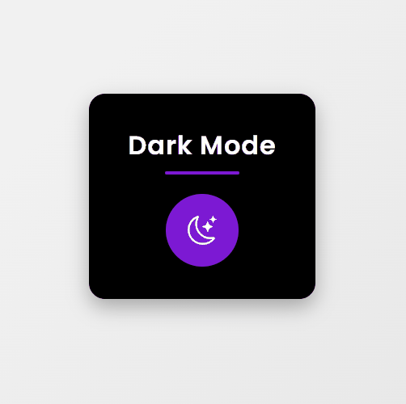

---

# 🌗 Dark Mode Toggle com Animações

Este projeto implementa um **botão interativo para alternar entre o modo claro e escuro**, com **animações suaves**, **design moderno** e **armazenamento da preferência do usuário** usando `localStorage`.




---

## ✨ **Recursos**

* **Alternância entre temas**: botão que troca entre **light** e **dark** mode.
* **Ícones dinâmicos**: sol 🌞 e lua 🌙 trocam automaticamente.
* **Animações CSS**:

  * `fadeInUp` na entrada do card.
  * `pulse` no botão com efeito de brilho.
* **Preferência persistente**: tema escolhido salvo no navegador com `localStorage`.
* **Responsivo e moderno**: design centralizado, fontes elegantes (`Poppins`), cores com gradiente e sombras suaves.

---

## 🚀 **Como usar**

1. **Clone este repositório**

   ```bash
   git clone https://github.com/seu-usuario/seu-repositorio.git
   ```
2. **Acesse a pasta do projeto**

   ```bash
   cd seu-repositorio
   ```
3. **Abra o arquivo `index.html` no navegador**

   * Clique no botão para alternar entre **modo claro** e **modo escuro**.
   * A escolha será salva e mantida quando recarregar a página.

---

## 🛠 **Tecnologias Utilizadas**

* **HTML5** → estrutura da página
* **CSS3** → estilização, animações, responsividade
* **JavaScript Vanilla** → lógica do botão, controle do tema e armazenamento no `localStorage`

---

## 📂 **Estrutura do Projeto**

```
📁 projeto-dark-mode
│-- index.html      # Estrutura da página
│-- style.css       # Estilização e animações
│-- main.js         # Lógica de alternância do tema
│-- demo.gif        # Demonstração do projeto (adicione aqui)
```

---

## 🎥 **Demonstração das Animações**

* **fadeInUp**: o container entra suavemente de baixo para cima.
* **pulse**: o botão tem um brilho pulsante contínuo.

---

## 🔮 **Melhorias Futuras**

* [ ] Adicionar mais opções de cores (temas customizados)
* [ ] Criar um interruptor deslizante (toggle switch estilizado)
* [ ] Adicionar suporte para animações mais complexas na transição de tema

---

## 👩‍💻 **Autora**

**Manoela Melo de Oliveira**
💻 [GitHub](https://github.com/ManoelaMeloOliv) | 🔗 [LinkedIn](https://linkedin.com)

---
